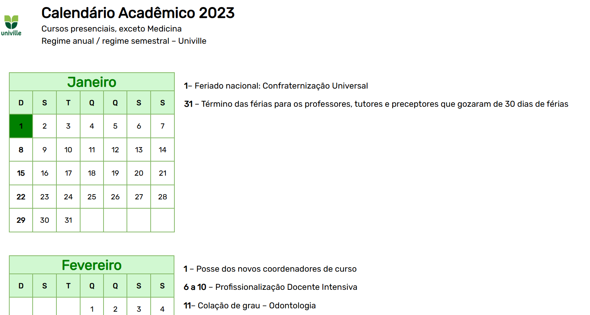

# 📅 Calendário Acadêmico Univille 2023

> Página com o calendário acadêmico completo de 2023 da Univille, exibindo datas importantes como feriados, colações de grau, recessos e prazos acadêmicos, com destaque por cores para cada tipo de evento.

## Demonstração

🔗 **Deploy ao vivo:** [juliazbarbosa.github.io/CALENDARIO_ACADEMICO](https://juliazbarbosa.github.io/CALENDARIO_ACADEMICO)

## Funcionalidades

- Exibição dos 12 meses do ano em formato de tabela
- Destaque visual por cores para diferentes tipos de evento (feriados, recessos, provas, colações de grau)
- Lista de eventos e datas importantes ao lado de cada mês
- Tipografia customizada (fonte Rubik)

## Tecnologias utilizadas

## 🧠 Aprendizados e desafios

Este projeto foi desenvolvido com foco em fixar fundamentos de HTML e CSS: estruturação de tabelas complexas, 
uso de tipografia customizada, organização de layout com Flexbox e aplicação de estilização condicional por classes 
para diferenciar visualmente os tipos de eventos ao longo do calendário.
